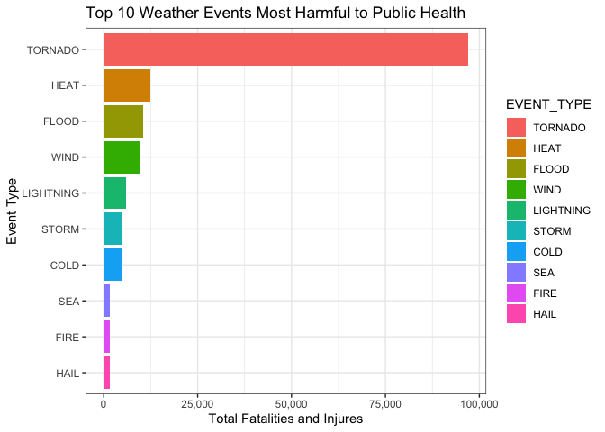
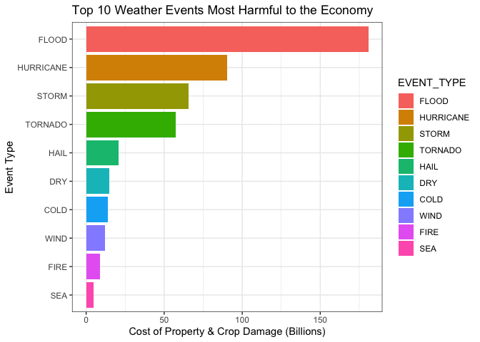

### **Synopsis**  
Storms and other severe weather events can cause both public health and economic  problems for communities and municipalities. Severe weather events can result in  fatalities, injuries, and property damage, and preventing such outcomes to the extent possible is a key concern.  

This project used publicly available data from the U.S. National Oceanic and   Atmospheric Administration's (NOAA) storm database to assess the impact on public health and the economy of major storm and weather events between 1950 and 2011.   Estimates of fatalities and injuries were used to quantify the effects of weather events on public health, while economic effects were measured via cost estimates of property and crop damage.  
  
### **Initialisation**  


Load packages ...  
  

``` r
if (!require(ggplot2)) {
    install.packages('ggplot2')
    library(ggplot2)
}
```

```
## Loading required package: ggplot2
```

``` r
if (!require(dplyr)) {
    install.packages('dplyr')
    library(dplyr, warn.conflicts = FALSE)
}
```

```
## Loading required package: dplyr
```

```
## 
## Attaching package: 'dplyr'
```

```
## The following objects are masked from 'package:stats':
## 
##     filter, lag
```

```
## The following objects are masked from 'package:base':
## 
##     intersect, setdiff, setequal, union
```

``` r
if (!require(data.table)) {
    install.packages('data.table')
    library(data.table, warn.conflicts = FALSE)
}
```

```
## Loading required package: data.table
```

```
## 
## Attaching package: 'data.table'
```

```
## The following objects are masked from 'package:dplyr':
## 
##     between, first, last
```

``` r
if (!require(knitr)) {
  install.packages('knitr')
  library(knitr, warn.conflicts = FALSE)
}
```

```
## Loading required package: knitr
```

``` r
if (!require(scales)) {
  install.packages('scales')
  library(scales, warn.conflicts = FALSE)
}
```

```
## Loading required package: scales
```

``` r
# sessionInfo()
```

### **Data Loading**  
The data for this assignment, in the form of a comma-separated-value file compressed via bzip2, can be downloaded from:   'https://d396qusza40orc.cloudfront.net/repdata%2Fdata%2FStormData.csv.bz2'  
  
There is also some database documentation available. Here you will find how some of the variables are constructed/defined. The events in the database start in the year 1950 and end in November 2011. In the earlier years of the database there are generally fewer events recorded, most likely due to a lack of good records. More recent years should be considered more complete.  
  
National Weather Service - Storm Data Documentation:   
'https://d396qusza40orc.cloudfront.net/repdata%2Fpeer2_doc%2Fpd01016005curr.pdf'  
  
National Climatic Data Center Storm Events - FAQ:  
'https://d396qusza40orc.cloudfront.net/repdata%2Fpeer2_doc%2FNCDC%20Storm%20Events-FAQ%20Page.pdf'  
  
If not found locally, download the bz2 compressed file from the source URL, unzip then load the csv data file via `data.table::fread`. Validate the loaded dataset by checking dataframe dimensions.  
  

``` r
# Retrieve data
setwd('~/Documents/Software/R/Data Science Foundations Using R/Reproducible Research/Project2')
path <- getwd()
url <- 'https://d396qusza40orc.cloudfront.net/repdata%2Fdata%2FStormData.csv.bz2'
file_path <- file.path(path, 'repdata_data_StormData.csv.bz2', sep = ',')

# Download and unzip only if necessary
if(!file.exists(file.path(path, 'repdata_data_StormData.csv'))) {
  download.file(url, file_path)
  unzip(zipfile = file_path, exdir = path)
}

storms_dt <- data.table::fread(file = 'repdata_data_StormData.csv')
stopifnot(dim(storms_dt) == c(902297, 37))
```


``` r
# Summary
names(storms_dt)
```

```
##  [1] "STATE__"    "BGN_DATE"   "BGN_TIME"   "TIME_ZONE"  "COUNTY"    
##  [6] "COUNTYNAME" "STATE"      "EVTYPE"     "BGN_RANGE"  "BGN_AZI"   
## [11] "BGN_LOCATI" "END_DATE"   "END_TIME"   "COUNTY_END" "COUNTYENDN"
## [16] "END_RANGE"  "END_AZI"    "END_LOCATI" "LENGTH"     "WIDTH"     
## [21] "F"          "MAG"        "FATALITIES" "INJURIES"   "PROPDMG"   
## [26] "PROPDMGEXP" "CROPDMG"    "CROPDMGEXP" "WFO"        "STATEOFFIC"
## [31] "ZONENAMES"  "LATITUDE"   "LONGITUDE"  "LATITUDE_E" "LONGITUDE_"
## [36] "REMARKS"    "REFNUM"
```

``` r
dim(storms_dt)
```

```
## [1] 902297     37
```

``` r
str(storms_dt)
```

```
## Classes 'data.table' and 'data.frame':	902297 obs. of  37 variables:
##  $ STATE__   : num  1 1 1 1 1 1 1 1 1 1 ...
##  $ BGN_DATE  : chr  "4/18/1950 0:00:00" "4/18/1950 0:00:00" "2/20/1951 0:00:00" "6/8/1951 0:00:00" ...
##  $ BGN_TIME  : chr  "0130" "0145" "1600" "0900" ...
##  $ TIME_ZONE : chr  "CST" "CST" "CST" "CST" ...
##  $ COUNTY    : num  97 3 57 89 43 77 9 123 125 57 ...
##  $ COUNTYNAME: chr  "MOBILE" "BALDWIN" "FAYETTE" "MADISON" ...
##  $ STATE     : chr  "AL" "AL" "AL" "AL" ...
##  $ EVTYPE    : chr  "TORNADO" "TORNADO" "TORNADO" "TORNADO" ...
##  $ BGN_RANGE : num  0 0 0 0 0 0 0 0 0 0 ...
##  $ BGN_AZI   : chr  "" "" "" "" ...
##  $ BGN_LOCATI: chr  "" "" "" "" ...
##  $ END_DATE  : chr  "" "" "" "" ...
##  $ END_TIME  : chr  "" "" "" "" ...
##  $ COUNTY_END: num  0 0 0 0 0 0 0 0 0 0 ...
##  $ COUNTYENDN: logi  NA NA NA NA NA NA ...
##  $ END_RANGE : num  0 0 0 0 0 0 0 0 0 0 ...
##  $ END_AZI   : chr  "" "" "" "" ...
##  $ END_LOCATI: chr  "" "" "" "" ...
##  $ LENGTH    : num  14 2 0.1 0 0 1.5 1.5 0 3.3 2.3 ...
##  $ WIDTH     : num  100 150 123 100 150 177 33 33 100 100 ...
##  $ F         : int  3 2 2 2 2 2 2 1 3 3 ...
##  $ MAG       : num  0 0 0 0 0 0 0 0 0 0 ...
##  $ FATALITIES: num  0 0 0 0 0 0 0 0 1 0 ...
##  $ INJURIES  : num  15 0 2 2 2 6 1 0 14 0 ...
##  $ PROPDMG   : num  25 2.5 25 2.5 2.5 2.5 2.5 2.5 25 25 ...
##  $ PROPDMGEXP: chr  "K" "K" "K" "K" ...
##  $ CROPDMG   : num  0 0 0 0 0 0 0 0 0 0 ...
##  $ CROPDMGEXP: chr  "" "" "" "" ...
##  $ WFO       : chr  "" "" "" "" ...
##  $ STATEOFFIC: chr  "" "" "" "" ...
##  $ ZONENAMES : chr  "" "" "" "" ...
##  $ LATITUDE  : num  3040 3042 3340 3458 3412 ...
##  $ LONGITUDE : num  8812 8755 8742 8626 8642 ...
##  $ LATITUDE_E: num  3051 0 0 0 0 ...
##  $ LONGITUDE_: num  8806 0 0 0 0 ...
##  $ REMARKS   : chr  "" "" "" "" ...
##  $ REFNUM    : num  1 2 3 4 5 6 7 8 9 10 ...
##  - attr(*, ".internal.selfref")=<externalptr>
```

``` r
head(storms_dt)
```

<div data-pagedtable="false">
  <script data-pagedtable-source type="application/json">
{"columns":[{"label":["STATE__"],"name":[1],"type":["dbl"],"align":["right"]},{"label":["BGN_DATE"],"name":[2],"type":["chr"],"align":["left"]},{"label":["BGN_TIME"],"name":[3],"type":["chr"],"align":["left"]},{"label":["TIME_ZONE"],"name":[4],"type":["chr"],"align":["left"]},{"label":["COUNTY"],"name":[5],"type":["dbl"],"align":["right"]},{"label":["COUNTYNAME"],"name":[6],"type":["chr"],"align":["left"]},{"label":["STATE"],"name":[7],"type":["chr"],"align":["left"]},{"label":["EVTYPE"],"name":[8],"type":["chr"],"align":["left"]},{"label":["BGN_RANGE"],"name":[9],"type":["dbl"],"align":["right"]},{"label":["BGN_AZI"],"name":[10],"type":["chr"],"align":["left"]},{"label":["BGN_LOCATI"],"name":[11],"type":["chr"],"align":["left"]},{"label":["END_DATE"],"name":[12],"type":["chr"],"align":["left"]},{"label":["END_TIME"],"name":[13],"type":["chr"],"align":["left"]},{"label":["COUNTY_END"],"name":[14],"type":["dbl"],"align":["right"]},{"label":["COUNTYENDN"],"name":[15],"type":["lgl"],"align":["right"]},{"label":["END_RANGE"],"name":[16],"type":["dbl"],"align":["right"]},{"label":["END_AZI"],"name":[17],"type":["chr"],"align":["left"]},{"label":["END_LOCATI"],"name":[18],"type":["chr"],"align":["left"]},{"label":["LENGTH"],"name":[19],"type":["dbl"],"align":["right"]},{"label":["WIDTH"],"name":[20],"type":["dbl"],"align":["right"]},{"label":["F"],"name":[21],"type":["int"],"align":["right"]},{"label":["MAG"],"name":[22],"type":["dbl"],"align":["right"]},{"label":["FATALITIES"],"name":[23],"type":["dbl"],"align":["right"]},{"label":["INJURIES"],"name":[24],"type":["dbl"],"align":["right"]},{"label":["PROPDMG"],"name":[25],"type":["dbl"],"align":["right"]},{"label":["PROPDMGEXP"],"name":[26],"type":["chr"],"align":["left"]},{"label":["CROPDMG"],"name":[27],"type":["dbl"],"align":["right"]},{"label":["CROPDMGEXP"],"name":[28],"type":["chr"],"align":["left"]},{"label":["WFO"],"name":[29],"type":["chr"],"align":["left"]},{"label":["STATEOFFIC"],"name":[30],"type":["chr"],"align":["left"]},{"label":["ZONENAMES"],"name":[31],"type":["chr"],"align":["left"]},{"label":["LATITUDE"],"name":[32],"type":["dbl"],"align":["right"]},{"label":["LONGITUDE"],"name":[33],"type":["dbl"],"align":["right"]},{"label":["LATITUDE_E"],"name":[34],"type":["dbl"],"align":["right"]},{"label":["LONGITUDE_"],"name":[35],"type":["dbl"],"align":["right"]},{"label":["REMARKS"],"name":[36],"type":["chr"],"align":["left"]},{"label":["REFNUM"],"name":[37],"type":["dbl"],"align":["right"]}],"data":[{"1":"1","2":"4/18/1950 0:00:00","3":"0130","4":"CST","5":"97","6":"MOBILE","7":"AL","8":"TORNADO","9":"0","10":"","11":"","12":"","13":"","14":"0","15":"NA","16":"0","17":"","18":"","19":"14.0","20":"100","21":"3","22":"0","23":"0","24":"15","25":"25.0","26":"K","27":"0","28":"","29":"","30":"","31":"","32":"3040","33":"8812","34":"3051","35":"8806","36":"","37":"1"},{"1":"1","2":"4/18/1950 0:00:00","3":"0145","4":"CST","5":"3","6":"BALDWIN","7":"AL","8":"TORNADO","9":"0","10":"","11":"","12":"","13":"","14":"0","15":"NA","16":"0","17":"","18":"","19":"2.0","20":"150","21":"2","22":"0","23":"0","24":"0","25":"2.5","26":"K","27":"0","28":"","29":"","30":"","31":"","32":"3042","33":"8755","34":"0","35":"0","36":"","37":"2"},{"1":"1","2":"2/20/1951 0:00:00","3":"1600","4":"CST","5":"57","6":"FAYETTE","7":"AL","8":"TORNADO","9":"0","10":"","11":"","12":"","13":"","14":"0","15":"NA","16":"0","17":"","18":"","19":"0.1","20":"123","21":"2","22":"0","23":"0","24":"2","25":"25.0","26":"K","27":"0","28":"","29":"","30":"","31":"","32":"3340","33":"8742","34":"0","35":"0","36":"","37":"3"},{"1":"1","2":"6/8/1951 0:00:00","3":"0900","4":"CST","5":"89","6":"MADISON","7":"AL","8":"TORNADO","9":"0","10":"","11":"","12":"","13":"","14":"0","15":"NA","16":"0","17":"","18":"","19":"0.0","20":"100","21":"2","22":"0","23":"0","24":"2","25":"2.5","26":"K","27":"0","28":"","29":"","30":"","31":"","32":"3458","33":"8626","34":"0","35":"0","36":"","37":"4"},{"1":"1","2":"11/15/1951 0:00:00","3":"1500","4":"CST","5":"43","6":"CULLMAN","7":"AL","8":"TORNADO","9":"0","10":"","11":"","12":"","13":"","14":"0","15":"NA","16":"0","17":"","18":"","19":"0.0","20":"150","21":"2","22":"0","23":"0","24":"2","25":"2.5","26":"K","27":"0","28":"","29":"","30":"","31":"","32":"3412","33":"8642","34":"0","35":"0","36":"","37":"5"},{"1":"1","2":"11/15/1951 0:00:00","3":"2000","4":"CST","5":"77","6":"LAUDERDALE","7":"AL","8":"TORNADO","9":"0","10":"","11":"","12":"","13":"","14":"0","15":"NA","16":"0","17":"","18":"","19":"1.5","20":"177","21":"2","22":"0","23":"0","24":"6","25":"2.5","26":"K","27":"0","28":"","29":"","30":"","31":"","32":"3450","33":"8748","34":"0","35":"0","36":"","37":"6"}],"options":{"columns":{"min":{},"max":[10]},"rows":{"min":[10],"max":[10]},"pages":{}}}
  </script>
</div>

``` r
sum(is.na(storms_dt))
```

```
## [1] 1745947
```
  
### **Data Processing**  
The source dataset contains 902,297 observations across 37 variables with a total of 1,745,947 missing values.Reformat dates before subsetting the source dataset by filtering out unwanted rows and selecting relevant columns to improve performance during analysis. Then clean event type by reviewing matching patterns in EVTYPE before aggregating related EVTYPEs.  
  
Columns to be retained:  
  
| Variable      | Description                                                 |
|:--------------|:------------------------------------------------------------|
| EVTYPE        | Event type         |
| BGN_DATE      | Begin date of the event                                     |
| END_DATE      | End date of the event                                       |
| STATE         | State where the event occurred                              |
| FATALITIES    | Number of fatalities per event                              |
| INJURIES      | Number of injuries per event                                |
| PROPDMG       | Property damage in USD per event                            |
| PROPDMGEXP    | Unit multiplier for property damage (K, M, or B)            |
| CROPDMG       | Crop damage in USD per event                                |
| CROPDMGEXP    | Unit multiplier for property damage (K, M, or B)            |
  
  
#### Process Dates  
Reformat BGN_DATE and END_DATE variables to POSIXct for analysis and reporting.  
  

``` r
  # Convert char to date
  storms_dt[, BGN_DATE := as.POSIXct(BGN_DATE, format = '%m/%d/%Y %H:%M:%S')]
  storms_dt[, END_DATE := as.POSIXct(END_DATE, format = '%m/%d/%Y %H:%M:%S')]
  
  # date calculations
  storms_dt$YEAR <- ifelse(!is.na(storms_dt$BGN_DATE)
                           ,as.integer(format(storms_dt$BGN_DATE, format = '%Y'))
                           ,NA)
  storms_dt$DURATION <- as.numeric(difftime(storms_dt$END_DATE, 
                                            storms_dt$BGN_DATE, 
                                            units = "hours"))
```
  
#### Subset storms_dt
Improve performance by using subset() to filter the rows and select specific columns. Relabel EVTYPE as EVENT_TYPE.  
  

``` r
  columns_to_select <- c('EVTYPE',
                         'YEAR',
                         'BGN_DATE',
                         'END_DATE',
                         'DURATION',
                         'STATE',
                         'FATALITIES',
                         'INJURIES',
                         'PROPDMG',
                         'PROPDMGEXP',
                         'CROPDMG',
                         'CROPDMGEXP')
  
  
  sub_storms_dt <- subset(
    storms_dt,
    EVTYPE != '?' & 
    !grepl('summary', EVTYPE, ignore.case = TRUE) &
    (FATALITIES > 0 | INJURIES > 0 | PROPDMG > 0 | CROPDMG > 0),
    select = columns_to_select
  )
  
  # rename EVTYPE > EVENT_TYPE
  setnames(sub_storms_dt, old = "EVTYPE", new = "EVENT_TYPE")
```
  
#### Clean Event Type   
Review matching patterns in EVENT_TYPE, then aggregate related EVENT_TYPEs to reduce the dimensionality of event type.  
  

``` r
pattern <- '.*(blizzard).*'
#unique(storms_dt[grepl(pattern, EVTYPE, ignore.case = TRUE), EVTYPE])
sub_storms_dt <- sub_storms_dt[, EVENT_TYPE := gsub(pattern, 'BLIZZARD', EVENT_TYPE, ignore.case = TRUE)]

pattern <- '.*(avalanche).*'
sub_storms_dt <- sub_storms_dt[, EVENT_TYPE := gsub(pattern, 'AVALANCHE', EVENT_TYPE, ignore.case = TRUE)]

pattern <- '.*(cold|freeze|frost|snow|ice|chill|glaze|icy|low temp).*'
sub_storms_dt <- sub_storms_dt[, EVENT_TYPE := gsub(pattern, 'COLD', EVENT_TYPE, ignore.case = TRUE)]

pattern <- '.*(cloud).*'
sub_storms_dt <- sub_storms_dt[, EVENT_TYPE := gsub(pattern, 'CLOUD', EVENT_TYPE, ignore.case = TRUE)]

pattern <- '.*(dry|drought).*'
sub_storms_dt <- sub_storms_dt[, EVENT_TYPE := gsub(pattern, 'DRY', EVENT_TYPE, ignore.case = TRUE)]

pattern <- '.*(dust).*'
sub_storms_dt <- sub_storms_dt[, EVENT_TYPE := gsub(pattern, 'DUST', EVENT_TYPE, ignore.case = TRUE)]

pattern <- '.*(fire|smoke).*'
sub_storms_dt <- sub_storms_dt[, EVENT_TYPE := gsub(pattern, 'FIRE', EVENT_TYPE, ignore.case = TRUE)]

pattern <- '.*(flood|rising water|fld|dam|drown|tsunami|stream).*'
sub_storms_dt <- sub_storms_dt[, EVENT_TYPE := gsub(pattern, 'FLOOD', EVENT_TYPE, ignore.case = TRUE)]

pattern <- '.*(fog).*'
sub_storms_dt <- sub_storms_dt[, EVENT_TYPE := gsub(pattern, 'FOG', EVENT_TYPE, ignore.case = TRUE)]

pattern <- '.*(hail).*'
sub_storms_dt <- sub_storms_dt[, EVENT_TYPE := gsub(pattern, 'HAIL', EVENT_TYPE, ignore.case = TRUE)]

pattern <- '.*(hypothermia).*'
sub_storms_dt <- sub_storms_dt[, EVENT_TYPE := gsub(pattern, 'HYPOTHERMIA', EVENT_TYPE, ignore.case = TRUE)]

pattern <- '.*(hyperthermia).*'
sub_storms_dt <- sub_storms_dt[, EVENT_TYPE := gsub(pattern, 'HYPERTHERMIA', EVENT_TYPE, ignore.case = TRUE)]

pattern <- '.*(hyperthermia).*'
sub_storms_dt <- sub_storms_dt[, EVENT_TYPE := gsub(pattern, 'HYPERTHERMIA', EVENT_TYPE, ignore.case = TRUE)]

pattern <- '.*(hot|heat|warm|high temp).*'
sub_storms_dt <- sub_storms_dt[, EVENT_TYPE := gsub(pattern, 'HEAT', EVENT_TYPE, ignore.case = TRUE)]

pattern <- '.*(hurricane).*'
sub_storms_dt <- sub_storms_dt[, EVENT_TYPE := gsub(pattern, 'HURRICANE', EVENT_TYPE, ignore.case = TRUE)]

pattern <- '.*(lightning|ligntning|light).*'
sub_storms_dt <- sub_storms_dt[, EVENT_TYPE := gsub(pattern, 'LIGHTNING', EVENT_TYPE, ignore.case = TRUE)]

pattern <- '.*(other|apache|mix).*'
sub_storms_dt <- sub_storms_dt[, EVENT_TYPE := gsub(pattern, 'OTHER', EVENT_TYPE, ignore.case = TRUE)]

pattern <- '.*(wet|rain|sleet|precip|water|drizzle|shower|spray|depression).*'
sub_storms_dt <- sub_storms_dt[, EVENT_TYPE := gsub(pattern, 'RAIN', EVENT_TYPE, ignore.case = TRUE)]

pattern <- '.*(sea|rip|surf|tide|marine|coastal|wave|swells).*'
sub_storms_dt <- sub_storms_dt[, EVENT_TYPE := gsub(pattern, 'SEA', EVENT_TYPE, ignore.case = TRUE)]

pattern <- '.*(seiche).*'
sub_storms_dt <- sub_storms_dt[, EVENT_TYPE := gsub(pattern, 'SEICHE', EVENT_TYPE, ignore.case = TRUE)]

pattern <- '.*(slide|slump|erosion).*'
sub_storms_dt <- sub_storms_dt[, EVENT_TYPE := gsub(pattern, 'MUD/ROCK/LANDSLIDE', EVENT_TYPE, ignore.case = TRUE)]

pattern <- '.*(storm|burst).*'
sub_storms_dt <- sub_storms_dt[, EVENT_TYPE := gsub(pattern, 'STORM', EVENT_TYPE, ignore.case = TRUE)]

pattern <- '.*(tornado|torndao|gustnado|spout|whirlwind).*'
sub_storms_dt <- sub_storms_dt[, EVENT_TYPE := gsub(pattern, 'TORNADO', EVENT_TYPE, ignore.case = TRUE)]

pattern <- '.*(urban).*'
sub_storms_dt <- sub_storms_dt[, EVENT_TYPE := gsub(pattern, 'URBAN', EVENT_TYPE, ignore.case = TRUE)]

pattern <- '.*(volcanic).*'
sub_storms_dt <- sub_storms_dt[, EVENT_TYPE := gsub(pattern, 'VOLCANIC', EVENT_TYPE, ignore.case = TRUE)]

pattern <- '.*(thunderstorm wind|high wind|strong wind|gusty wind|tstm|wind|turbulence).*'
sub_storms_dt <- sub_storms_dt[, EVENT_TYPE := gsub(pattern, 'WIND', EVENT_TYPE, ignore.case = TRUE)]

pattern <- '.*(winter|wintry).*'
sub_storms_dt <- sub_storms_dt[, EVENT_TYPE := gsub(pattern, 'WINTER', EVENT_TYPE, ignore.case = TRUE)]
```
  

``` r
# Summary of the cleaned dataset
names(sub_storms_dt)
```

```
##  [1] "EVENT_TYPE" "YEAR"       "BGN_DATE"   "END_DATE"   "DURATION"  
##  [6] "STATE"      "FATALITIES" "INJURIES"   "PROPDMG"    "PROPDMGEXP"
## [11] "CROPDMG"    "CROPDMGEXP"
```

``` r
dim(sub_storms_dt)          # (254632, 12)
```

```
## [1] 254632     12
```

``` r
str(sub_storms_dt)
```

```
## Classes 'data.table' and 'data.frame':	254632 obs. of  12 variables:
##  $ EVENT_TYPE: chr  "TORNADO" "TORNADO" "TORNADO" "TORNADO" ...
##  $ YEAR      : int  1950 1950 1951 1951 1951 1951 1951 1952 1952 1952 ...
##  $ BGN_DATE  : POSIXct, format: "1950-04-18" "1950-04-18" ...
##  $ END_DATE  : POSIXct, format: NA NA ...
##  $ DURATION  : num  NA NA NA NA NA NA NA NA NA NA ...
##  $ STATE     : chr  "AL" "AL" "AL" "AL" ...
##  $ FATALITIES: num  0 0 0 0 0 0 0 0 1 0 ...
##  $ INJURIES  : num  15 0 2 2 2 6 1 0 14 0 ...
##  $ PROPDMG   : num  25 2.5 25 2.5 2.5 2.5 2.5 2.5 25 25 ...
##  $ PROPDMGEXP: chr  "K" "K" "K" "K" ...
##  $ CROPDMG   : num  0 0 0 0 0 0 0 0 0 0 ...
##  $ CROPDMGEXP: chr  "" "" "" "" ...
##  - attr(*, ".internal.selfref")=<externalptr>
```

``` r
head(sub_storms_dt)
```

<div data-pagedtable="false">
  <script data-pagedtable-source type="application/json">
{"columns":[{"label":["EVENT_TYPE"],"name":[1],"type":["chr"],"align":["left"]},{"label":["YEAR"],"name":[2],"type":["int"],"align":["right"]},{"label":["BGN_DATE"],"name":[3],"type":["dttm"],"align":["right"]},{"label":["END_DATE"],"name":[4],"type":["dttm"],"align":["right"]},{"label":["DURATION"],"name":[5],"type":["dbl"],"align":["right"]},{"label":["STATE"],"name":[6],"type":["chr"],"align":["left"]},{"label":["FATALITIES"],"name":[7],"type":["dbl"],"align":["right"]},{"label":["INJURIES"],"name":[8],"type":["dbl"],"align":["right"]},{"label":["PROPDMG"],"name":[9],"type":["dbl"],"align":["right"]},{"label":["PROPDMGEXP"],"name":[10],"type":["chr"],"align":["left"]},{"label":["CROPDMG"],"name":[11],"type":["dbl"],"align":["right"]},{"label":["CROPDMGEXP"],"name":[12],"type":["chr"],"align":["left"]}],"data":[{"1":"TORNADO","2":"1950","3":"1950-04-18","4":"<NA>","5":"NA","6":"AL","7":"0","8":"15","9":"25.0","10":"K","11":"0","12":""},{"1":"TORNADO","2":"1950","3":"1950-04-18","4":"<NA>","5":"NA","6":"AL","7":"0","8":"0","9":"2.5","10":"K","11":"0","12":""},{"1":"TORNADO","2":"1951","3":"1951-02-20","4":"<NA>","5":"NA","6":"AL","7":"0","8":"2","9":"25.0","10":"K","11":"0","12":""},{"1":"TORNADO","2":"1951","3":"1951-06-08","4":"<NA>","5":"NA","6":"AL","7":"0","8":"2","9":"2.5","10":"K","11":"0","12":""},{"1":"TORNADO","2":"1951","3":"1951-11-15","4":"<NA>","5":"NA","6":"AL","7":"0","8":"2","9":"2.5","10":"K","11":"0","12":""},{"1":"TORNADO","2":"1951","3":"1951-11-15","4":"<NA>","5":"NA","6":"AL","7":"0","8":"6","9":"2.5","10":"K","11":"0","12":""}],"options":{"columns":{"min":{},"max":[10]},"rows":{"min":[10],"max":[10]},"pages":{}}}
  </script>
</div>

``` r
sum(is.na(sub_storms_dt))   # 101,856
```

```
## [1] 101856
```

``` r
length(unique(storms_dt$EVTYPE))        # 985
```

```
## [1] 985
```

``` r
length(unique(sub_storms_dt$EVENT_TYPE))    # 28
```

```
## [1] 28
```
  
The cleaned dataset contains 254,632 observations across 10 variables with a total of 101,856 missing values. The number of unique EVENT_TYPEs has been reduced from 985 to 28.  
  
#### Clean Economic Data  
The National Weather Service - Storm Data Documentation:  
'https://d396qusza40orc.cloudfront.net/repdata%2Fpeer2_doc%2Fpd01016005curr.pdf'  
indicates that two variables are used to record property (`PROPDMG` and `PROPDMGEXP`) and crop (`CROPDMG` and `CROPDMGEXP`) damage.`*DMG` is the significand while `*DMGEXP` is the exponent or multiplier of `*DMG`. The multipliers are supposed to be: "K" for thousands, "M" for millions and "B" for billions however other characters are also used:  
Unique PROPDMGEXP:  
"K" "M" ""  "B" "m" "+" "0" "5" "6" "?" "4" "2" "3" "h" "7" "H" "-" "1" "8"  
Unique CROPDMGEXP:  
""  "M" "K" "m" "B" "?" "0" "k" "2"  
  
Standardise multipliers and calculate the cost of property and crop damage:  
  

``` r
  # Conversion function to standardise the multiplier
  cleanMultiplier <- function(exp){
    exp <- toupper(exp)
    
    # Create a named vector with the possible values and their  
    # corresponding multipliers
    multiplier = c("-" = 10^0,
                   "?" = 10^0,
                   "+" = 10^0,
                   "0" = 10^0,
                   "1" = 10^1, 
                   "2" = 10^2, 
                   "3" = 10^3,
                   "4" = 10^4, 
                   "5" = 10^5, 
                   "6" = 10^6, 
                   "7" = 10^7,
                   "8" = 10^8, 
                   "9" = 10^9, 
                   "H" = 10^2, 
                   "K" = 10^3,
                   "M" = 10^6, 
                   "B" = 10^9)
    
    # Handle the empty string case separately
    if (exp == "") return(10^0)
    
    # Return the corresponding multiplier or 10^0 if the exp is not in the vector
    result <- multiplier[match(exp, names(multiplier), nomatch = NA)]
    return(ifelse(is.na(result), 10^0, result))
  }
  
  # Calculate property and crop damage costs (in billions)
  sub_storms_dt$PROP_COST <- with(sub_storms_dt, as.numeric(PROPDMG) * sapply(PROPDMGEXP, cleanMultiplier))/10^9
  sub_storms_dt$CROP_COST <- with(sub_storms_dt, as.numeric(CROPDMG) * sapply(CROPDMGEXP, cleanMultiplier))/10^9
```
  
### **Data Summary**   
#### Public Health Data  
Summarise the impact of weather events by event type on public health (fatalities and injuries) and sort in descending order of health impact.  
  

``` r
  sub_storms_dt[, HEALTH_IMPACT := FATALITIES + INJURIES]

  # Aggregate the data by EVENT_TYPE, summarising the total health impact per event type
  health_impact_summary <- aggregate(HEALTH_IMPACT ~ EVENT_TYPE,
                                     data = sub_storms_dt,
                                     FUN = sum,
                                     na.rm = TRUE)
  # Desc order of HEALTH_IMPACT
  health_impact_summary <- health_impact_summary[order(-health_impact_summary$HEALTH_IMPACT), ]
  
  head(health_impact_summary)
```

<div data-pagedtable="false">
  <script data-pagedtable-source type="application/json">
{"columns":[{"label":[""],"name":["_rn_"],"type":[""],"align":["left"]},{"label":["EVENT_TYPE"],"name":[1],"type":["chr"],"align":["left"]},{"label":["HEALTH_IMPACT"],"name":[2],"type":["dbl"],"align":["right"]}],"data":[{"1":"TORNADO","2":"96998","_rn_":"23"},{"1":"HEAT","2":"12371","_rn_":"12"},{"1":"FLOOD","2":"10405","_rn_":"9"},{"1":"WIND","2":"9731","_rn_":"27"},{"1":"LIGHTNING","2":"6049","_rn_":"16"},{"1":"STORM","2":"4722","_rn_":"22"}],"options":{"columns":{"min":{},"max":[10]},"rows":{"min":[10],"max":[10]},"pages":{}}}
  </script>
</div>
  
#### Economic Data  
Summarise the impact of weather events by event type on the economy (cost of property and crop damage) and sort in descending order of economic cost.  
  

``` r
  sub_storms_dt[, ECON_COST := PROP_COST + CROP_COST]

  # Aggregate the data by EVENT_TYPE, summarising the total cost of economic        # damage per event type
  econ_impact_summary <- aggregate(ECON_COST ~ EVENT_TYPE,
                                   data = sub_storms_dt,
                                   FUN = sum,
                                   na.rm = TRUE)
  # Desc order of ECON_COST
  econ_impact_summary <- econ_impact_summary[order(-econ_impact_summary$ECON_COST), ]
  
  head(econ_impact_summary)
```

<div data-pagedtable="false">
  <script data-pagedtable-source type="application/json">
{"columns":[{"label":[""],"name":["_rn_"],"type":[""],"align":["left"]},{"label":["EVENT_TYPE"],"name":[1],"type":["chr"],"align":["left"]},{"label":["ECON_COST"],"name":[2],"type":["dbl"],"align":["right"]}],"data":[{"1":"FLOOD","2":"180.78828","_rn_":"9"},{"1":"HURRICANE","2":"90.27147","_rn_":"14"},{"1":"STORM","2":"65.80719","_rn_":"22"},{"1":"TORNADO","2":"57.36724","_rn_":"23"},{"1":"HAIL","2":"20.73705","_rn_":"11"},{"1":"DRY","2":"15.02568","_rn_":"6"}],"options":{"columns":{"min":{},"max":[10]},"rows":{"min":[10],"max":[10]},"pages":{}}}
  </script>
</div>
  
### **Results**  
#### Events Most Harmful to Public Health  
Table and chart of the top 10 weather event types causing the most fatalities and injuries.  
  

``` r
  kable(head(health_impact_summary, 10),
        col.names = c('Event Type', 'Health Impact (Fatalities & Injuries)'),
        row.names = FALSE,
        align = c("l", "l"))
```


|Event Type |Health Impact (Fatalities & Injuries) |
|:----------|:-------------------------------------|
|TORNADO    |96998                                 |
|HEAT       |12371                                 |
|FLOOD      |10405                                 |
|WIND       |9731                                  |
|LIGHTNING  |6049                                  |
|STORM      |4722                                  |
|COLD       |4634                                  |
|SEA        |1701                                  |
|FIRE       |1698                                  |
|HAIL       |1512                                  |

``` r
  # specify factor levels for the legend in the same order as the data
  health_impact_summary$EVENT_TYPE <- factor(health_impact_summary$EVENT_TYPE,
                                      levels = health_impact_summary$EVENT_TYPE)
  
  g <- ggplot(head(health_impact_summary, 10),
              aes(x = reorder(EVENT_TYPE, HEALTH_IMPACT), 
                  y = HEALTH_IMPACT, 
                  fill = EVENT_TYPE)) +
              coord_flip() +
              geom_bar(stat = "identity") + 
              # Add commas to the y-axis values
              scale_y_continuous(labels = label_comma()) +  
              labs(title = "Top 10 Weather Events Most Harmful to Public Health",
                   x = "Event Type", 
                   y = "Total Fatalities and Injures") +
              theme(plot.title = element_text(size = 14, hjust = 0.5)) +
              theme_bw()
  print(g)
```

<!-- -->
  
#### Events Most Harmful to the Economy  
Table and chart of the top 10 weather event types causing the most property and crop damage.  
  

``` r
  kable(head(econ_impact_summary, 10),
        col.names = c('Event Type', 
                      'Economic Impact (Cost of Property & Crop Damage (Billions))'),
        row.names = FALSE,
        align = c("l", "l"))  # left-align columns
```


|Event Type |Economic Impact (Cost of Property & Crop Damage (Billions)) |
|:----------|:-----------------------------------------------------------|
|FLOOD      |180.788284                                                  |
|HURRICANE  |90.271473                                                   |
|STORM      |65.807194                                                   |
|TORNADO    |57.367236                                                   |
|HAIL       |20.737054                                                   |
|DRY        |15.025675                                                   |
|COLD       |13.855241                                                   |
|WIND       |11.865759                                                   |
|FIRE       |8.905010                                                    |
|SEA        |4.763995                                                    |

``` r
  # specify factor levels for the legend in the same order as the data
  econ_impact_summary$EVENT_TYPE <- factor(econ_impact_summary$EVENT_TYPE,
                                    levels = econ_impact_summary$EVENT_TYPE)
  
  g <- ggplot(head(econ_impact_summary, 10),
              aes(x = reorder(EVENT_TYPE, ECON_COST), 
                  y = ECON_COST, 
                  fill = EVENT_TYPE)) +
              coord_flip() +
              geom_bar(stat = "identity") + 
              # Add commas to the y-axis values
              scale_y_continuous(labels = label_comma()) +  
              labs(title = "Top 10 Weather Events Most Harmful to the Economy",
                   x = "Event Type", 
                   y = "Cost of Property & Crop Damage (Billions)") +
              theme(plot.title = element_text(size = 14, hjust = 0.5)) +
              theme_bw()
  print(g)
```

<!-- -->
  
  
### **Conclusion**  
This analysis of the U.S. National Oceanic and Atmospheric Administration's storm data suggests that Tornadoes, Heat and Floods, in that order, are most harmful to public health. They cause the most combined fatalities and injuries of any weather events in the U.S. In contrast, the greatest economic harm to the U.S economy, in descending dollar value of property and crop damage, is caused by Floods, Hurricanes and Storms.  


